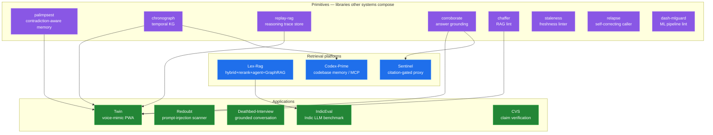
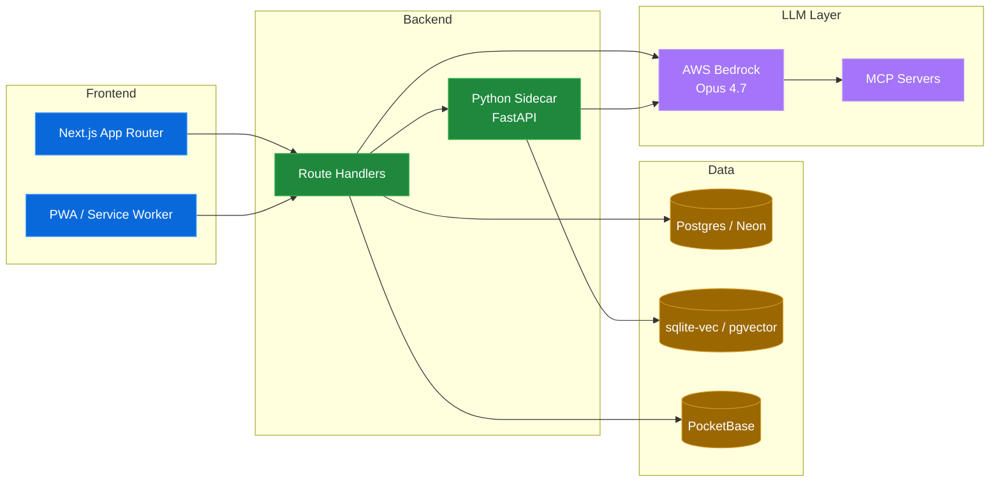
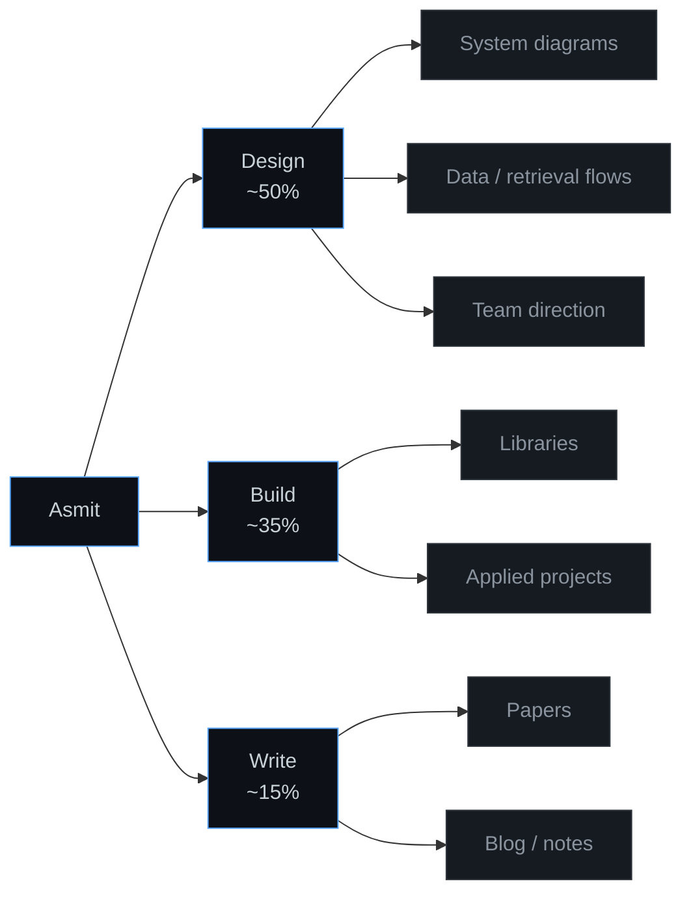

# Asmit Dash

**I design AI systems for a living.** AI Systems Architect Intern @ Deloitte · Mumbai, IN

---

## How my projects actually connect

## The stack I default to

## How I split my time

---

## Publications · [ORCID 0009-0003-4247-9312](https://orcid.org/0009-0003-4247-9312) · [Google Scholar](https://scholar.google.com/citations?user=tyKozHwAAAAJ&hl=en)

- A Survey on Retrieval-Augmented Generation (RAG) Models: Recent Advances and Challenges
- Multimodal Emotion Recognition using Hierarchical Contrastive Residual Cross-Attention Fusion
- Facial Landmark-Based Face Shape Classification: A Lightweight Approach for Real-Time Applications
- A Bayesian Network to Model the Influence of Energy Consumption on Greenhouse Gases in Italy

---

Portfolio [asmit-dash.vercel.app](https://asmit-dash.vercel.app) · [LinkedIn](https://www.linkedin.com/in/asmitdash/) · [Twitter](https://twitter.com/AsmitDash007) · [Instagram](https://www.instagram.com/asmittdashh/) · asmitdash44@gmail.com
