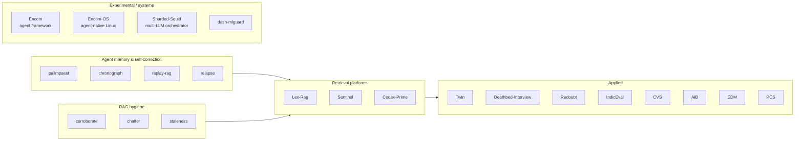

<h1>Asmit Dash</h1>

<em>I design AI systems for a living.</em>

AI Systems Architect Intern @ Deloitte · Mumbai, IN · B.Tech Computer Engineering, University of Mumbai

---

## One diagram, whole portfolio

Every node is a real repo. Click through on the profile — the graph is the portfolio.

---

## Featured work — deeper

### 🧠 Agent-memory libraries (Python, all mine)
[palimpsest](https://github.com/asmitdash/palimpsest) · [chronograph](https://github.com/asmitdash/chronograph) · [replay-rag](https://github.com/asmitdash/replay-rag) · [relapse](https://github.com/asmitdash/relapse) · [corroborate](https://github.com/asmitdash/corroborate) · [chaffer](https://github.com/asmitdash/chaffer) · [staleness](https://github.com/asmitdash/staleness) · [dash-mlguard](https://github.com/asmitdash/dash-mlguard)

### 🔧 Retrieval & memory platforms
[Lex-Rag](https://github.com/asmitdash/lex-rag) — advanced RAG (hybrid+rerank+agent+GraphRAG)
[Sentinel](https://github.com/asmitdash/sentinel) — citation-gated LLM proxy
[Codex-Prime](https://github.com/asmitdash/codex-prime) — codebase memory over MCP + Cognee

### 🛠️ Applied
[Twin](https://github.com/asmitdash/twin) — voice-mimic-with-retrieval PWA
[IndicEval](https://github.com/asmitdash/indic-eval) — Indic LLM benchmark
[CVS](https://github.com/asmitdash/CVS) — generic claim verification
[Redoubt](https://github.com/asmitdash/redoubt) — prompt-injection scanner
[Deathbed-Interview](https://github.com/asmitdash/deathbed-interview) — grounded conversation with a memory graph

### 🧬 Systems-y experiments
[Encom](https://github.com/asmitdash/encom) — open-source agent framework in Rust
[Encom-OS](https://github.com/asmitdash/encom-os) — Linux distro where the agent layer is part of the OS
[Sharded-Squid](https://github.com/asmitdash/sharded-squid) — Bedrock-orchestrating desktop app that drives your ChatGPT/Gemini/Perplexity accounts

---

## Publications

- A Survey on Retrieval-Augmented Generation (RAG) Models: Recent Advances and Challenges
- Multimodal Emotion Recognition using Hierarchical Contrastive Residual Cross-Attention Fusion
- Facial Landmark-Based Face Shape Classification: A Lightweight Approach for Real-Time Applications
- A Bayesian Network to Model the Influence of Energy Consumption on Greenhouse Gases in Italy

📇 [ORCID 0009-0003-4247-9312](https://orcid.org/0009-0003-4247-9312) · 📘 [Google Scholar](https://scholar.google.com/citations?user=tyKozHwAAAAJ&hl=en)

---

<strong>Elsewhere:</strong> <a href="https://asmit-dash.vercel.app">Portfolio</a> · <a href="https://www.linkedin.com/in/asmitdash/">LinkedIn</a> · <a href="https://twitter.com/AsmitDash007">Twitter</a> · <a href="https://www.instagram.com/asmittdashh/">Instagram</a> · asmitdash44@gmail.com

