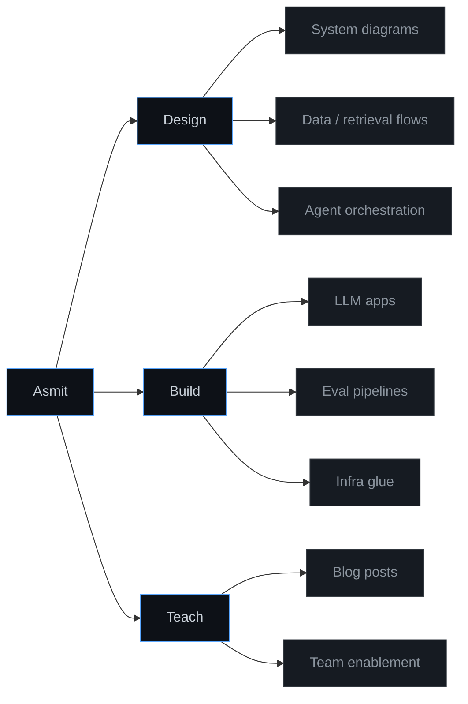
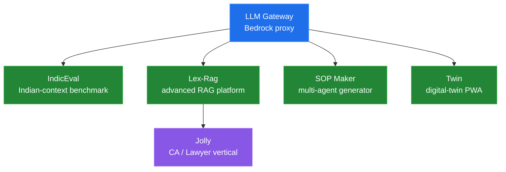
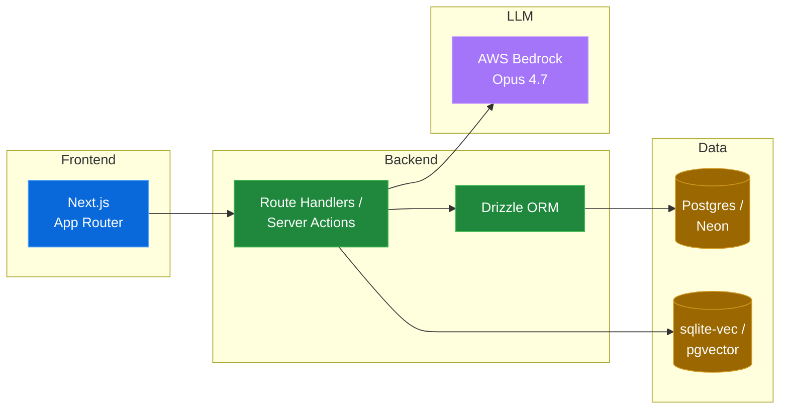

# Asmit Dash

AI Systems Architect Intern @ Deloitte. I think in diagrams before I think in code.

## How I split my work

## How my current projects relate

## The stack I default to

## Contact

- LinkedIn — [asmitdash](https://www.linkedin.com/in/asmitdash)
- Twitter — [@AsmitDash007](https://twitter.com/AsmitDash007)
- Email — asmitdash44@gmail.com
